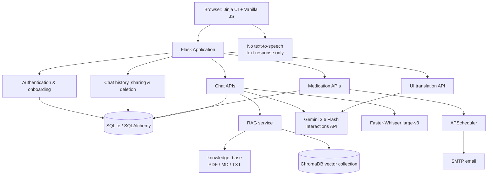
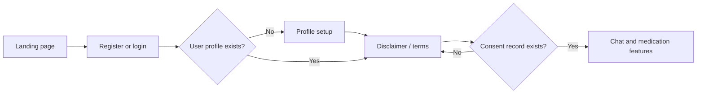
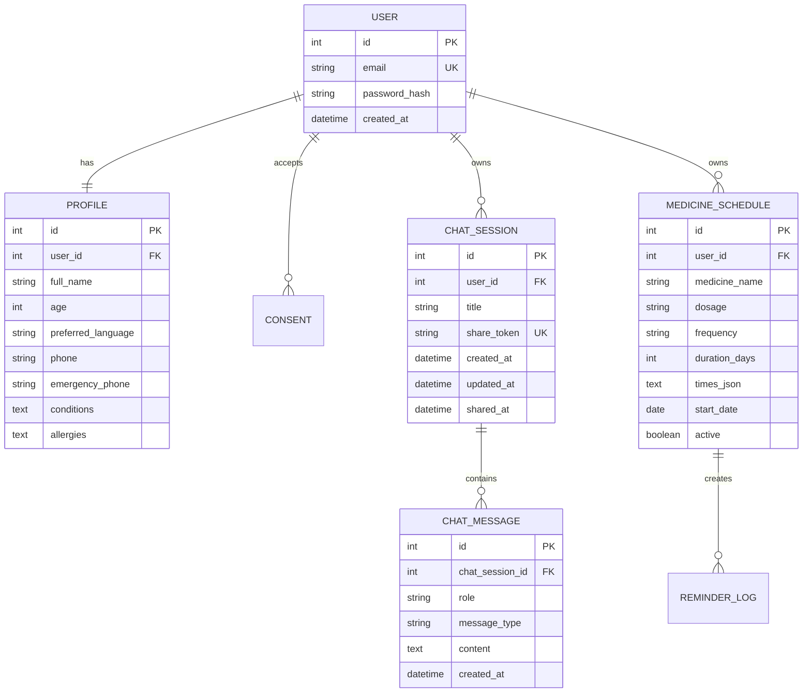
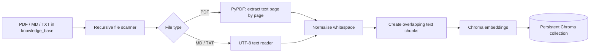
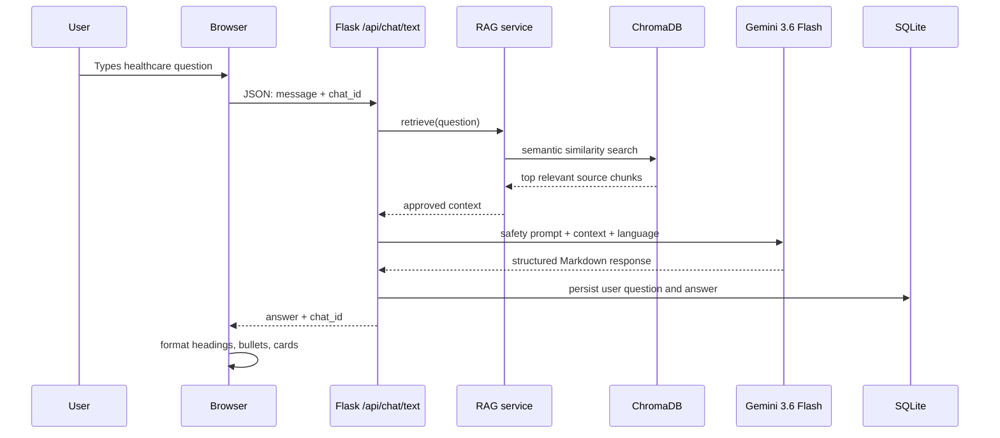
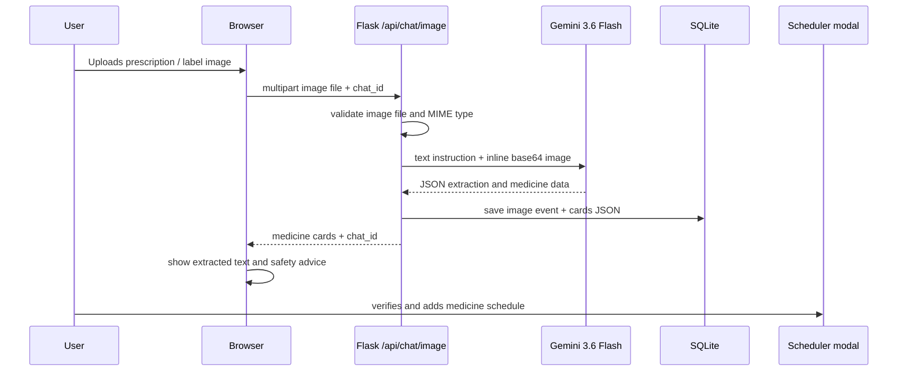
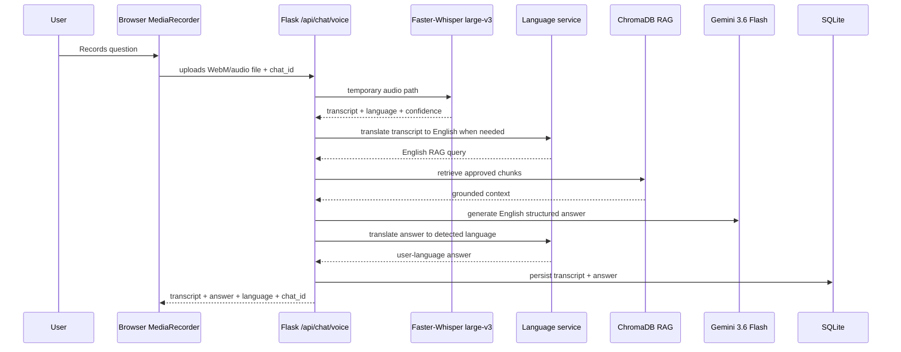
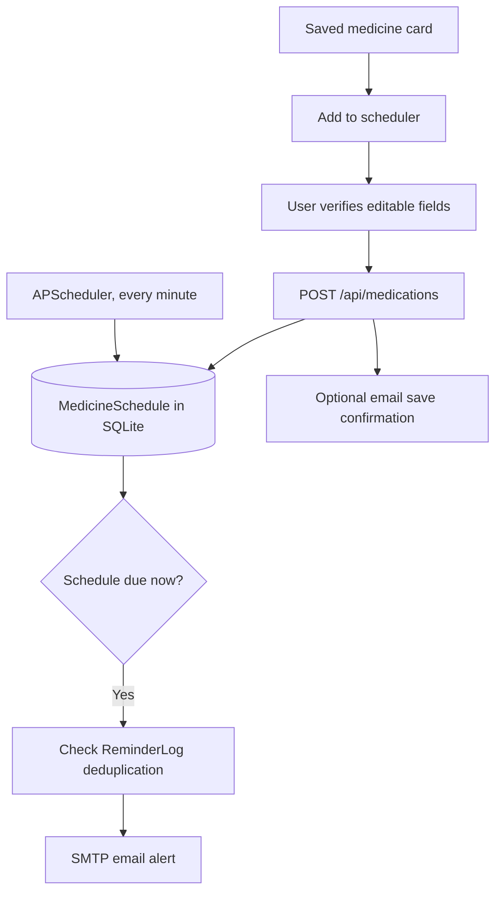
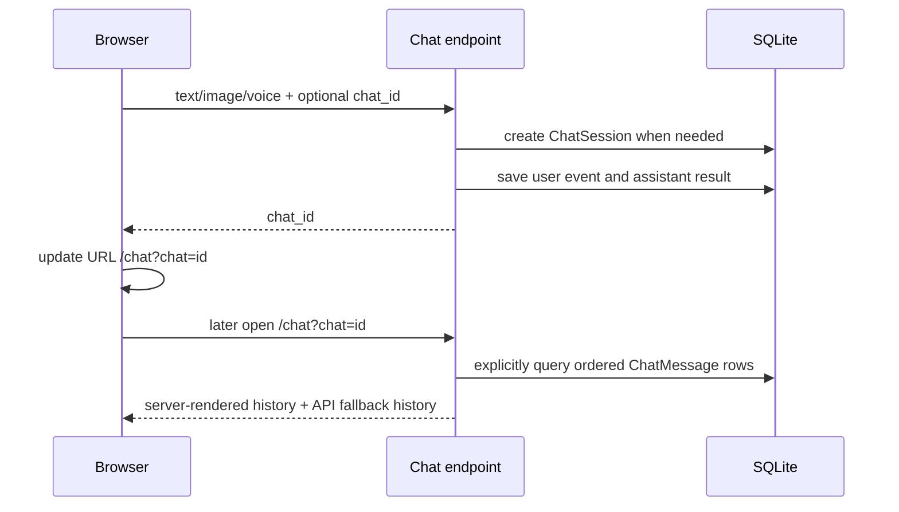
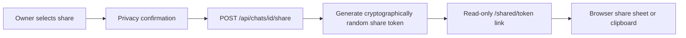

# Care Companion — Detailed Project Architecture

## 1. Purpose and system boundary

Care Companion is a Flask/Jinja2 healthcare-information web application. It gives simple, multilingual, knowledge-base-grounded healthcare information through text, prescription images, and voice recordings. It is **not** a diagnosis, emergency-response, or prescribing system.

### Core capabilities

- Registration, login, profile setup, disclaimer acceptance
- Persistent chat sessions, saved chat taskbar, deletion, and share links
- Text RAG over approved healthcare PDFs, Markdown, and text files
- Prescription-image extraction into structured medicine cards
- Voice transcription using Faster-Whisper, multilingual translation, RAG, and text output
- Medication schedule creation and optional SMTP email notifications
- Profile-language-driven AI responses and runtime static UI localisation

---

## 2. High-level architecture



---

## 3. Technology stack

| Area | Technology | Purpose |
|---|---|---|
| Web framework | Flask | Page routing, APIs, sessions, backend orchestration |
| UI rendering | Jinja2 | Server-rendered landing, auth, profile, chat, calendar, shared-chat pages |
| Frontend | Vanilla JavaScript + CSS | Multimodal UI, chat rendering, saved-chat controls, localisation, effects |
| User sessions | Flask-Login | Authenticated user sessions and protected routes |
| Password storage | Werkzeug security | Password hashing and checking |
| Relational store | SQLite | Users, profiles, consent, sessions, messages, schedules, reminder logs |
| ORM | Flask-SQLAlchemy / SQLAlchemy | Database models and persistence |
| Vector store | ChromaDB | Stores and searches knowledge-base chunks |
| Source parsing | PyPDF | Page-level text extraction from readable PDFs |
| LLM | Gemini 3.6 Flash | Grounded answers, prescription understanding, UI text translation |
| Gemini protocol | Google Generative Language Interactions API | Multimodal REST requests for Gemini 3.6 Flash |
| Translation SDK | `google-genai` | Language identification and medical-preserving translations |
| Speech recognition | Faster-Whisper `large-v3` | Local audio transcription and language identification |
| Scheduler | APScheduler | Demo/single-process reminder checks |
| Email | SMTP / Python smtplib | Optional medication alert delivery |
| Configuration | `python-dotenv` | Loads `.env` secrets and settings |

---

## 4. Repository structure

```text
carecompanion/
├── app.py                         # Flask app, routes, APIs, orchestration
├── config.py                      # Environment-based runtime configuration
├── extensions.py                  # SQLAlchemy and Flask-Login instances
├── models.py                      # SQLite models
├── run.py                         # Local app launcher
├── requirements.txt               # Python dependencies
├── .env                           # Private local configuration; never commit
├── knowledge_base/                # Approved healthcare PDFs, MD, TXT sources
├── services/
│   ├── rag.py                     # Chroma ingestion + semantic retrieval
│   ├── gemini.py                  # Gemini 3.6 Interactions API client
│   ├── language.py                # Language detection and translation helpers
│   ├── voice.py                   # Faster-Whisper transcription
│   ├── scheduler.py               # APScheduler reminder dispatching
│   └── notifications.py            # SMTP email sending
├── templates/
│   ├── base.html                  # Shared sidebar, global scripts
│   ├── index.html                 # Landing page
│   ├── auth.html                  # Login / registration
│   ├── profile.html               # User profile
│   ├── consent.html               # Disclaimer / consent
│   ├── chat.html                  # Main authenticated chat UI
│   ├── medications.html           # Medication calendar
│   └── shared_chat.html           # Read-only shared chat
└── static/
    ├── css/style.css              # Theme, responsive UI, healthcare animation
    ├── js/app.js                  # Saved chat controls and global UI behavior
    ├── js/chat.js                 # Text/image/voice chat client logic
    ├── js/i18n.js                 # Runtime static UI localisation
    └── images/                    # Optional SVG visual assets
```

---

## 5. Authentication and onboarding architecture



### Route protection

| Decorator / control | Purpose |
|---|---|
| `@login_required` | Requires a valid Flask-Login session |
| `@onboarding_required` | Requires both profile and accepted consent before sensitive features |
| API unauthorized handler | Returns JSON `401` rather than an HTML login redirect for JavaScript requests |

### Database entities involved

- `User`: email, password hash, created date
- `Profile`: name, age, selected language, reminder email, emergency contact, conditions, allergies
- `Consent`: acceptance timestamp and version

---

## 6. Database architecture



### Chat persistence format

`ChatMessage.content` stores:

| `message_type` | Stored content |
|---|---|
| `text` | User question or assistant answer text |
| `voice` | Transcribed user voice question |
| `image` | Upload event label, such as “Prescription image uploaded” |
| `cards` | JSON with extraction text, medicine cards, and advice |

The active session ID is returned by the API and stored in the browser URL:

```text
/chat?chat=<chat_id>
```

This lets chat history reload after browser refresh or a later login.

---

## 7. Knowledge-base ingestion and RAG architecture

### Source directory

```text
knowledge_base/
├── healthcare-guide.pdf
├── medication-information.pdf
├── health_basics.md
└── speciality/
    └── diabetes-guide.txt
```

### Ingestion pipeline



### Ingestion details

1. `KnowledgeBase` recursively scans `knowledge_base/` for `.pdf`, `.md`, and `.txt` files.
2. A content fingerprint is generated from source paths and bytes.
3. When files change, the collection is rebuilt to avoid stale chunks.
4. Readable PDFs are extracted page-by-page using `pypdf.PdfReader`.
5. Text is normalised and split into approximately 1,100-character chunks with approximately 180-character overlap.
6. Every chunk has Chroma metadata:
   - source relative path
   - source type
   - page number for PDF sources
7. ChromaDB persists the data under `chroma_store/`.

> Image-only/scanned PDFs require an OCR stage before they can provide text for RAG ingestion.

### Retrieval method

```python
collection.query(
    query_texts=[question],
    n_results=4
)
```

The default collection uses ChromaDB’s default embedding implementation and HNSW approximate nearest-neighbour search. In the current collection configuration, the default distance space is L2/Euclidean distance.

---

## 8. Text chat RAG pipeline



### Prompt constraints

Gemini is instructed to:

- Use only the retrieved knowledge-base context.
- State when the knowledge base lacks sufficient information.
- Avoid diagnoses, invented facts, prescriptions, and new doses.
- Use clear non-technical language.
- Return structured sections when relevant:

```markdown
## Summary

## What you can do
- Action from the supplied knowledge base

## When to seek help
- Warning sign supported by the knowledge base
```

### Failure handling

If Gemini cannot respond, the backend does **not** show a raw long PDF chunk. It produces a concise structured fallback:

```markdown
## Summary

## Relevant information
- Up to four relevant extracted sentences

## Important
- Verify the original prescription and contact a clinician/pharmacist when needed.
```

---

## 9. Prescription-image pipeline



### Gemini request structure

```json
{
  "model": "gemini-3.6-flash",
  "input": [
    {"type": "text", "text": "Read this prescription..."},
    {
      "type": "image",
      "data": "BASE64_ENCODED_IMAGE",
      "mime_type": "image/jpeg"
    }
  ],
  "response_modalities": ["text"]
}
```

### Expected medicine-card schema

```json
{
  "extracted_text": "Text visible on the image",
  "medicines": [
    {
      "medicine_name": "Medicine shown on source",
      "dosage": "Dose shown",
      "frequency": "Frequency shown",
      "duration": "Duration shown",
      "use_case": "Use shown"
    }
  ],
  "general_advice": "Verify all details against the original prescription."
}
```

### Safety behavior

- Unclear handwritten text must not be guessed.
- Each field can indicate pharmacist confirmation is needed.
- The feature extracts information; it does not create a new prescription.
- Saved card JSON is rendered again when users reopen the chat.

---

## 10. Voice pipeline

Voice output / text-to-speech is **not included**. Voice is an input modality only.



### Voice stages

1. Browser obtains microphone access with `getUserMedia`.
2. `MediaRecorder` creates an audio file, typically WebM.
3. Flask writes it to a temporary file.
4. Faster-Whisper `large-v3` transcribes with:
   - `beam_size=5`
   - VAD enabled
   - `temperature=0`
   - automatic language detection
5. The detected speech is translated to English for a common RAG query representation.
6. ChromaDB retrieves relevant English knowledge chunks.
7. Gemini creates a safe structured answer.
8. The answer is translated back to the detected speech language.
9. The temporary audio file is deleted.

### GPU / CPU configuration

```env
# CPU-safe default
WHISPER_MODEL=large-v3
WHISPER_DEVICE=cpu
WHISPER_COMPUTE_TYPE=int8

# CUDA option
# WHISPER_DEVICE=cuda
# WHISPER_COMPUTE_TYPE=float16
```

FFmpeg is required for browser-recorded WebM support.

---

## 11. Profile language and UI localisation

```mermaid
flowchart LR
    A[User selects language in profile] --> B[Profile.preferred_language in SQLite]
    B --> C[Flask context processor]
    C --> D[base.html data-ui-language]
    D --> E[i18n.js]
    E --> F[/api/ui/translate]
    F --> G[Gemini translation batch]
    G --> H[Static interface text translated]
```

### Behaviour

- The `preferred_language` profile field controls target UI language.
- `i18n.js` gathers static interface labels while excluding user messages, assistant messages, medicine cards, email addresses, and saved chat titles.
- It sends short batches to `/api/ui/translate`.
- Gemini returns a JSON key-value translation map.
- Dynamic health answers are already generated/translated through the text and voice pipelines.
- If translation is unavailable, English UI remains readable instead of breaking the page.

---

## 12. Medication scheduling and email alerts



### Schedule fields

- Medicine name
- Dosage
- Frequency
- Duration in days
- Start date
- Reminder times
- Use case/note

`ReminderLog` makes each reminder unique per schedule, date, and scheduled time to reduce duplicate email messages.

> APScheduler is appropriate for a local demo or one-process deployment. Production should use a durable task queue and scheduler, such as Celery + Redis, cloud schedules, or managed background jobs.

---

## 13. Saved chats, deletion, and sharing

### Persistence and restore



### Share flow



### Data ownership controls

- A normal chat ID can only be opened by its owning authenticated user.
- Deleting a `ChatSession` deletes associated `ChatMessage` rows through relationship cascade.
- A shared link is read-only.
- Anyone with the token can read a shared chat, so users must be warned before sharing sensitive information.
- A production implementation should add share-link revocation and expiry.

---

## 14. Main HTTP routes

| Route | Method | Purpose |
|---|---|---|
| `/` | GET | Landing page |
| `/register` | GET, POST | Registration |
| `/login` | GET, POST | Login |
| `/logout` | GET | End session |
| `/profile` | GET, POST | Profile and selected language |
| `/consent` | GET, POST | Disclaimer consent |
| `/chat` | GET | Chat page, optional `?chat=<id>` |
| `/api/chat/text` | POST | Text RAG question |
| `/api/chat/image` | POST | Prescription image understanding |
| `/api/chat/voice` | POST | Faster-Whisper voice pipeline |
| `/api/chats` | POST | Create blank session |
| `/api/chats/<id>` | GET | Load saved messages |
| `/api/chats/<id>` | DELETE | Delete saved chat |
| `/api/chats/<id>/share` | POST | Create/reuse share URL |
| `/shared/<token>` | GET | Read-only shared chat |
| `/medications` | GET | Calendar / saved schedules |
| `/api/medications` | POST | Save medication schedule |
| `/api/medications/<id>` | DELETE | Remove schedule |
| `/api/ui/translate` | POST | Profile-language static UI localisation |
| `/api/health` | GET | Deployment/vector diagnostic endpoint |

---

## 15. Security and production requirements

Before real patient-facing use, add or complete the following:

1. HTTPS, HSTS, secure cookies, and a production WSGI server.
2. CSRF protection for all state-changing routes.
3. Rate limits for login, Gemini, upload, translation, and share routes.
4. File magic-byte validation, size limits, malware scanning, and storage isolation.
5. PostgreSQL or another managed DB for concurrent production use instead of SQLite.
6. Encryption at rest, encrypted backups, log redaction, and restricted operator access.
7. Durable worker scheduling rather than in-process APScheduler.
8. Clinical review, document source versioning, and approval workflow for all knowledge-base data.
9. Share-token revocation, expiry, and access audit logs.
10. Privacy, legal, and safety review for the intended deployment jurisdiction.
11. Clear emergency messaging and a strict non-diagnostic/non-prescribing policy.

---

## 16. Environment configuration reference

```env
SECRET_KEY=replace_with_a_long_random_value

GEMINI_API_KEY=your_google_ai_studio_api_key
GEMINI_MODEL=gemini-3.6-flash

WHISPER_MODEL=large-v3
WHISPER_DEVICE=cpu
WHISPER_COMPUTE_TYPE=int8

SMTP_HOST=smtp.gmail.com
SMTP_PORT=587
SMTP_USERNAME=your_email@example.com
SMTP_PASSWORD=your_email_app_password
SMTP_FROM=your_email@example.com
SMTP_USE_TLS=true
```

---

## 17. End-to-end summary

```text
Authenticated profile language
        │
        ├── Static UI localisation through i18n.js + Gemini batch translation
        │
Text question ────────┐
Image prescription ───┼──> Flask validation/orchestration ──> SQLite chat save
Voice recording ──────┘                 │
                                         ├── ChromaDB RAG over approved documents
                                         ├── Gemini 3.6 Flash for grounded multimodal reasoning
                                         ├── Faster-Whisper for voice transcription
                                         └── Optional medication / SMTP reminder workflows
```
